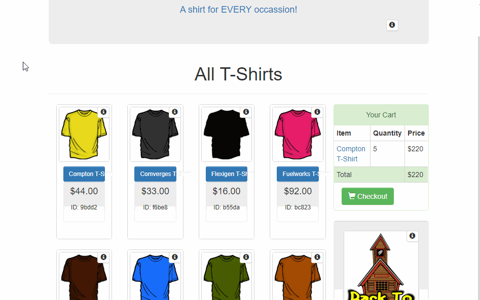

.. _getting_started__the_scenario:

The Scenario 👕
-------------------

**Here is the story**, you want to buy a T-Shirt on Google's 
`Demo Store <https://enhancedecommerce.appspot.com/>`_ and you will test if the "Add To Cart" *event* is well implemented.

The *test case* will consist of a few simple steps:

1. Go to https://enhancedecommerce.appspot.com/
2. Click on the "Compton T-Shirt" product
3. Click on the "Add To Cart" button
4. Test if all events are well implemented

