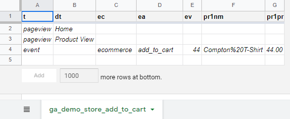

.. howtos:

How Tos
=================

In this part, we assume you already have the basics of GAUnit. If not,
we advise to read the :ref:`tutorial` section.

Write a tracking plan
-------------------------

with a JSON file 
^^^^^^^^^^^^^^^^^

See :ref:`write_tracking_plan` from *Getting Started* section to get an example 
of a ``tracking_plan.json`` file.

You can then import the file with these 2 lines of code:

.. code:: python
    
    import gaunit

    tracking_plan = gaunit.TrackingPlan.from_json("tracking_plan.json")

with Google Sheet
^^^^^^^^^^^^^^^^^^^^

Google Sheets can be very convenient for tracking plans:

- they are shareable and easily accessible
- they allow collaborative editing
- anyone from business teams to business partners can read or contribute

With GAunit, you can import tracking plans from Google Sheets (thanks to `gspread <https://gspread.readthedocs.io/en/latest/>`_). 
Here is how it works :

- Each tab corresponds to a test case
- Lines correspond to events
- Columns correspond to event parameters

In this Spreadsheet, we import one test case named ``ga_demo_store_add_to_cart`` for which we expect 3 events:

This Spreadsheet publicly is available `here <https://docs.google.com/spreadsheets/d/1Kd68s3vLrBqtMDW-PaALZF-5bTm-4J450YbJ3NTbZjQ>`_

**Let's see how to do that!**

Create a Python file where you will import the Google Spreadsheet.
For example, name it ``demo_store_add_to_cart.py``.

First, we need to authenticate with gspread. Have a look at documentation 
(`gspread authentication <https://gspread.readthedocs.io/en/latest/oauth2.html>`_) to choose the method that suits you.
In this example, we use *Service Account* authentication :

.. code:: python

    import gaunit
    import gspread

    gc = gspread.service_account(filename="service_account.json")

.. note::

    Authentication with gspread is mandatory, even for public Spreadsheets.

Now, we can open the Spreadsheet and import it with :meth:`~gaunit.TrackingPlan.from_spreadsheet()` method:

.. code::

    gsheet = gc.open_by_key("1Kd68s3vLrBqtMDW-PaALZF-5bTm-4J450YbJ3NTbZjQ")

    tracking_plan = gaunit.TrackingPlan.from_spreadsheet(gsheet)
    expected_events = tracking_plan.get_expected_events("ga_demo_store_add_to_cart")
    print(expected_events)
    # [{'t': 'pageview', 'dt': 'Home'}, {'t': 'pageview', 'dt': 'Product View'}, {'t': 'event', 'ec': 'ecommerce', ..}]

**It worked!**

.. note::

    Full source code can be found on Github:
    `Tracking Plan from Gsheet sample <https://github.com/VinceCabs/GAUnit/tree/master/samples/tracking_plan_from_gsheet>`_

In Python
^^^^^^^^^^^^

This is very simple. Two methods can help you here: 

- :meth:`~gaunit.TrackingPlan.from_events()` which returns a :class:`~gaunit.TrackingPlan`
- :meth:`~gaunit.TrackingPlan.add_test_case()` which adds a test case to an existing instance of :class:`~gaunit.TrackingPlan`

We will see them both. First, write the expected events for your test case 
called ``demo_store_add_to_cart`` in a list:

.. code:: python

    expected_events = [
        {
            "t": "pageview",
            "dt": "Home"
        },
        {   "t": "pageview", 
            "dt": "Product View"
        },
        {
            "t": "event",
            "ec": "ecommerce",
            "ea": "add_to_cart",
            "ev": "44",
            "pr1nm": "Compton T-Shirt",
            "pr1pr": "44.00",
        }
    ]

Now, you can create your tracking plan (2 methods):

.. code:: 

    import gaunit

    tracking_plan = gaunit.TrackingPlan.from_events("demo_store_add_to_cart", expected_events)
    # or you can do this way:
    tracking_plan = gaunit.TrackingPlan()
    tracking_plan.add_test_case("demo_store_add_to_cart", expected_events)

You can add as many test cases as you want with the :meth:`~gaunit.TrackingPlan.add_test_case()` method.

Extract existing events for future tests
^^^^^^^^^^^^^^^^^^^^^^^^^^^^^^^^^^^^^^^^^^

WIP

Check a HAR file from command line
--------------------------------------

WIP

Use GAUnit in your CI/CD
-----------------------------------

WIP