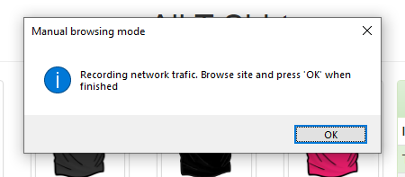

Test Google Analytics implementations 
----------------------------------------

Once you have a :class:`~gaunit.TrackingPlan`, you want to run test cases and check GA events. 
This part describes various ways to do that.

Check a HAR file from command line
^^^^^^^^^^^^^^^^^^^^^^^^^^^^^^^^^^^^^^^^

See :ref:`command__gaunit` shell command.

Automated testing for GA4 implementations
^^^^^^^^^^^^^^^^^^^^^^^^^^^^^^^^^^^^^^^^^^^^^^^^^^

If you followed :ref:`getting_started__automatic_test` tutorial in *Getting Started* section, you already know
how to build full automated tests for GA and GA4 implementations. But at the time of writing this documention, 
there is no proper GA4 Demo website we know of, so the tutorial above is based on a simple Google Analytics (not GA4) demo website from Google.

This said, **you might want to test GAUnit with a real GA4 implementation anyway**, and we totally understand that!

Don't worry, we have built a very simple demo website with GA4 implementation and we provide you with a full working GAUnit example:

- Demo website: https://vincecabs.github.io/ga4_with_gtag_js/
- full working example on Github: https://github.com/VinceCabs/GAUnit/blob/master/examples/auto_test_with_proxy_ga4/

.. note::

    As said just above, except for events parameters which are different, **there is no difference between GA and GA4 testing with GAUnit**.
    If you are here to learn how to test GA and GA4 implementations, be sure to follow :ref:`tutorial` tutorial.

Launch a manual browsing session to check events
^^^^^^^^^^^^^^^^^^^^^^^^^^^^^^^^^^^^^^^^^^^^^^^^^^

Sometimes, automating test cases is too much work if you only want to perform
a few tests.

What if we could use Python and GAunit to:

- **open a browser session** already set up with a proxy,
- **manually run** the test case (do the browsing yourself instead of Selenium),
- when done, **let GAUnit check GA events** against a tracking plan?

This is possible and here is how to do that!

First, you need to :ref:`getting_started__install_selenium_browsermob`.

.. todo: separated part for install

Create a Python file (for examples, named ``demo_store_add_to_cart.py``).
Set up a proxy to record network trafic in HAR and create a webdriver using this proxy
(see :ref:`getting_started__automatic_test` tutorial in *Getting Started*):

.. code:: Python

    import gaunit
    from browsermobproxy import Server
    from selenium import webdriver

    # set up proxy
    server = Server()  # or add path to binary: 'Server(path="browsermob-proxy")'
    server.start()
    # 'useEcc' is needed to have decent response time with HTTPS
    proxy = server.create_proxy({"useEcc": True})

    # 'captureContent' for POST requests
    proxy.new_har("demo_store_add_to_cart", options={"captureContent": True})

    options = webdriver.ChromeOptions()
    options.add_argument("--proxy-server=%s" % proxy.proxy)
    # options.add_argument("--headless")  # uncomment if you want headless Chrome
    capabilities = webdriver.DesiredCapabilities.CHROME.copy()
    capabilities["acceptInsecureCerts"] = True
    driver = webdriver.Chrome(options=options, desired_capabilities=capabilities)

But now it gets different from a full automated test case; let's use a dialog box to pause 
execution and give hand to the user until he or she says:

.. code:: Python

    from tkinter import messagebox

    messagebox.showinfo(
        "Manual browsing mode",
        "Recording network trafic. Browse site, then press 'OK' when you're finished",
    )

This code will open a dialog box:

The code to run after the user presses 'OK' is: export har, close all, check events againts tracking plan
(see :ref:`getting_started__automatic_test` tutorial in *Getting Started* section):

.. code:: Python

    # export har and close all
    har = proxy.har
    server.stop()
    driver.quit()

    # check events against tracking plan and print results
    tracking_plan = gaunit.TrackingPlan.from_json("tracking_plan.json")
    r = gaunit.check_har(test_case, tracking_plan, har=har)

    r.print_result(display_ok=True)

.. image:: ../img/print_result.jpg

**That's it!**

.. note::

   Full source code can be found on Github: `GAUnit manual test session <https://github.com/VinceCabs/GAUnit/tree/master/examples/manual_test_session>`_