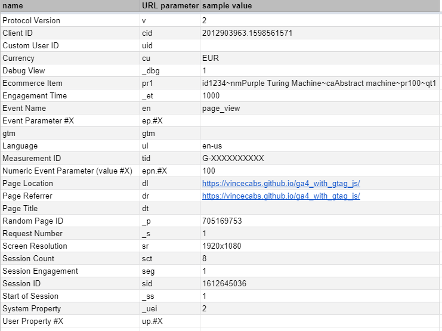

.. _tracking_plan:

Tracking Plan Documentation
-----------------------------

A *tracking plan* defines the expected events for one or more test cases.
GAUnit defines tracking *events* by their URL parameters, as you would see in Network console or in Google Tag Assistant.

.. todo: screenshot

In future versions of GAUnit, you will be able to use GA4 APIs parameters (``analytics.js``, ``gtag.js``).

.. todo: move this text to explanation section

event

test case

tracking plan

Format
^^^^^^^^

JSON
"""""""""""""""""""

.. code:: json

    {
    "test_cases": {
        "test_case_1": {
            "events": [
                {

GA4 parameters
^^^^^^^^^^^^^^^^

As the time of writing, there is no documentation from Google regarding GA4 URL parameters. However, you can refer to this list we created, which specifies most common parameters:

`link to spreadsheet <https://docs.google.com/spreadsheets/d/16GwQHr4rh_S3nEMu2oHBZrRNhRe_VrDZqLt9Aik8kwc/>`_

GA parameters
^^^^^^^^^^^^^^

use the (`GA Measurement Protocol <https://developers.google.com/analytics/devguides/collection/protocol/v1/parameters>`_

