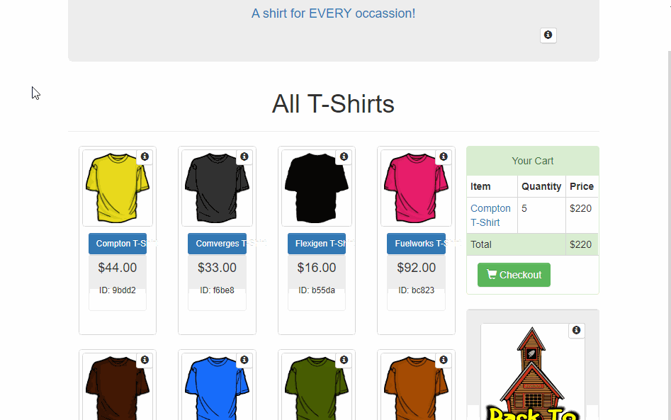
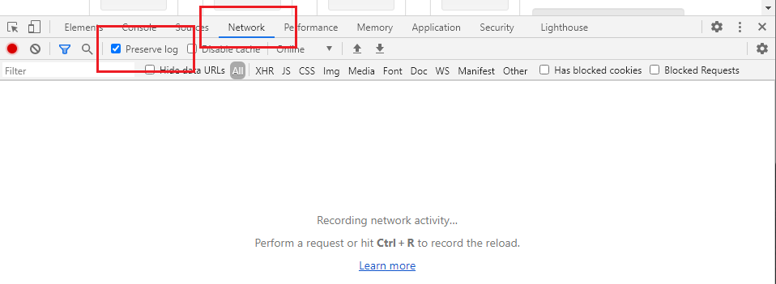
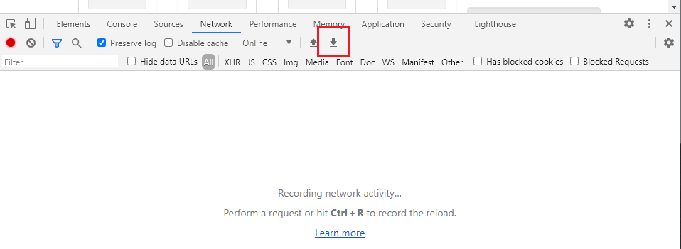
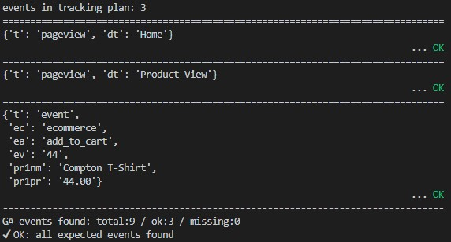

.. _tutorial:

Getting Started
=================

This is a simple step by step guide on how to test Google Analytics 
implementations with GAUnit.

At the end of this guide, **you will be able to perform manual and automatic tests with GAUnit**.

First, make sure you have Python and GAUnit installed (see :ref:`install`).

.. _the_scenario:

The Scenario 👕
-------------------

**Here is the story**, you want to buy a T-Shirt on Google's 
`Demo Store <https://enhancedecommerce.appspot.com/>`_ and you will test if the "Add To Cart" *event* is well implemented.

This tutorial has 3 parts:

- :ref:`write_tracking_plan`
- :ref:`manual_test`: to get a grasp on how GAUnit works, you will export network traffic recorded in the Chrome console and check if *events* are OK
- :ref:`automatic_test`: alternatively, you will use GAUnit APIs to perform a full automated test with Selenium and BrowserMob Proxy

*The last 2 parts can be done independantly.*

The *test case* will consist of a few simple steps:

1. Go to https://enhancedecommerce.appspot.com/
2. Click on the "Compton T-Shirt" product
3. Click on the "Add To Cart" button
4. Test if all events are well implemented

**Let's start!**

.. _write_tracking_plan:

Write your tracking plan 📑
------------------------------

GAUnit offers various ways to define a *tracking plan*. Below, you will
use a JSON file. You could also use Google Sheet or Python dictionary to define which
events you expect for your test case, but that's for later (see :ref:`howtos`).

First, create a ``tracking_plan.json`` file where you specify the expected 
events:

.. code-block:: JSON

   {
      "test_cases": {
         "demo_store_add_to_cart": {
            "events": [
               {
                  "t": "pageview",
                  "dt": "Home"
               },
               {
                  "t": "pageview",
                  "dt": "Product View"
               },
               {
                  "t": "event",
                  "ec": "ecommerce",
                  "ea": "add_to_cart",
                  "ev": "44",
                  "pr1nm": "Compton T-Shirt",
                  "pr1pr": "44.00"
               }
            ]
         }
      }
   }

Few remarks here:

- In a *tracking plan*, you can define more than one *test case*. Which is normal, given that you may have several test cases for your website!
- Here, we named our *test case* ``demo_store_add_to_cart``
- For this test case, you expect at least 3 events: 
   - the ``Home`` page view, 
   - the ``Product View`` page view,
   - the ``Add To Cart`` click (with event value and product price)

.. note::

   GAUnit is compatible with all versions of GA:
   `analytics.js <https://developers.google.com/analytics/devguides/collection/protocol/v1/parameters>`_, 
   `gtag.js <https://developers.google.com/analytics/devguides/collection/gtagjs>`_ 
   and `GA4 properties <https://developers.google.com/analytics/devguides/collection/ga4>`_

.. _manual_test:

Manual Check 🚗
--------------------------

*Make sure you have done this part:* :ref:`write_tracking_plan`

In this part, you will export network traffic into a HAR file. 
Then, **you will use GAUnit to check if tracking plan is OK**.

.. note::

   In this tutorial, we use Chrome, but you could use any tool 
   to get a HAR file: Firefox Developer Tool, proxies, etc.

Open Chrome Network panel
^^^^^^^^^^^^^^^^^^^^^^^^^^^^

Open Chrome and open DevTools: *Command+Option+J* (Mac) or *Control+Shift+J* (Windows, Linux, Chrome OS).

Go to the Network panel and check "Preserve Log":

Browse site and export HAR file
^^^^^^^^^^^^^^^^^^^^^^^^^^^^^^^^^^^^^^^^^^^^^

**Let's start our test case!**

On the same Chrome tab, enter this address: https://enhancedecommerce.appspot.com/. 
It is important to use the same tab to record the browsing session.

Click on the "Compton T-Shirt".

On the Compton T-Shirt product page, click on the "Add To Cart" button.

Export the browsing session into a HAR File: in the Network panel, 
click on the small "Export HAR..." icon:

Save the HAR file in the same directory you use 
for this tutorial. Name it ``demo_store_add_to_cart.har``.

Check if Google Analytics events are OK 
^^^^^^^^^^^^^^^^^^^^^^^^^^^^^^^^^^^^^^^^^^^^^^

**Almost done!**

You will write a simple Python script to check if the expected events (defined in
tracking plan) were fired.

Create a new ``demo_store_add_to_cart.py`` Python file.

.. note::

   Use this command at each step to run the file: 
   ``python demo_store_add_to_cart.py``

First, add these lines to create a :class:`~gaunit.TrackingPlan` and import  
the ``tracking_plan.json`` file you wrote ealier.

.. code:: Python

   import gaunit
   
   tracking_plan = gaunit.TrackingPlan.from_json("tracking_plan.json")

*Optional*: print the events for your test case with 
:meth:`~gaunit.TrackingPlan.get_expected_events()`

.. code:: Python

   events = tracking_plan.get_expected_events("demo_store_add_to_cart")
   print(events)
   # [{"t": "pageview", "dt": "Home"}, ...]

Now, let's :meth:`~gaunit.check_har()` and print the result.

.. code:: Python

   # get result
   r = gaunit.check_har(
      "demo_store_add_to_cart", tracking_plan, har_path="demo_store_add_to_cart.har"
   )
   print( r.was_successful() )
   # True

The :meth:`~gaunit.Result.was_successful()` method is the simplest way to know if the test passed because it gives you a 
bool ``True`` or ``False``. But you can get more details on the test. For example:

.. code:: Python

   # Checklist of the expected events actually found in HAR ('True' if present)
   print( r.checklist_expected_events )
   # [True, True, True]

   # All GA events actually found in HAR
   print ( r.actual_events )
   # [{'v': '1', '_v': 'j87', 'a': '1597243964', 't': 'pageview', 'dt': 'Home'}, ..]

   # Pretty print the result of the test (and display all events)
   r.print_result(display_ok=True)

This last line shall print this in console:

**Bravo! You've just made your first GAUnit test!**

.. note::

   Full source code can be found on Github: `GAUnit Getting started sample <https://github.com/VinceCabs/GAUnit/tree/master/samples/getting_started>`_

Bonus: do the same with command line
^^^^^^^^^^^^^^^^^^^^^^^^^^^^^^^^^^^^^^^^^^^^^

Sometimes, it's better to use command line directly, instead of Python.
GAUnit lets you do that:

.. code:: console

   $ gaunit demo_store_add_to_cart.har demo_store_add_to_cart

See :ref:`command` documentation on how to use GAUnit commands. They can be useful for your
CI/CD pipelines.

.. TODO What if test fails?

.. _automatic_test:

Automatic test with Selenium 🚀
------------------------------------------------------------

**Instead of tedious manual tests, let's automate!**

What if we could automate the whole process?

- browse on the site
- record all GA events
- check the events against the tracking plan

Install Selenium and BrowserMob Proxy
^^^^^^^^^^^^^^^^^^^^^^^^^^^^^^^^^^^^^^^^^^

First, you need to install Selenium to automate browsing and 
BrowserMob Proxy to intercept Google Analytics events.

- Install `Selenium <https://selenium-python.readthedocs.io/>`_ and `Browsermob Proxy <https://browsermob-proxy-py.readthedocs.io>`_ Python packages:

.. code:: console

   pip install selenium browsermob-proxy

- Download `BrowserMob Proxy latest release <https://github.com/lightbody/browsermob-proxy/releases/latest>`_ (note: requires `Java <https://www.oracle.com/java/technologies/javase-jre8-downloads.html>`_).
   - unzip it where convenient for you
   - add the ``bin/`` directory to your ``%PATH``

- Download `ChromeDriver <https://sites.google.com/a/chromium.org/chromedriver/downloads>`_
   - unzip it where convenient for you
   - add it to your ``%PATH`` or copy it in your working directory (more details `here <https://selenium-python.readthedocs.io/installation.html#drivers>`_)

- Here is a simple way to test if install is OK:

.. code:: console

   $ browsermob-proxy --version
   BrowserMob Proxy X.X.X
   $ chromedriver --version
   ChromeDriver XX.XX.XX (XX)

Full automation with Python
^^^^^^^^^^^^^^^^^^^^^^^^^^^^^^^^^^^^^^^^^^

*Make sure you have done this part:* :ref:`write_tracking_plan`

**You will now fully automate the process of testing GA implementation**.

Create a new Python file, for example: ``demo_store_add_to_cart.py`` as in previous section.

Import the required packages for our test:

.. code:: Python

   import gaunit
   from browsermobproxy import Server
   from selenium import webdriver

Create a BrowserMob Proxy server and activate it:

.. code:: python

   # set up proxy
   server = Server()  # or add path to binary: 'Server(path="browsermob-proxy")'
   server.start()
   # 'useEcc' is needed to have decent response time with HTTPS
   proxy = server.create_proxy({"useEcc": True})

Set BrowserMob Proxy to record a new har:

.. code:: python

   proxy.new_har("demo_store_add_to_cart")

Create a webdriver and configure it to use the newly created proxy:

.. code:: python

   options = webdriver.ChromeOptions()
   options.add_argument("--proxy-server=%s" % proxy.proxy)
   # options.add_argument("--headless")  # uncomment if you want headless Chrome
   capabilities = webdriver.DesiredCapabilities.CHROME.copy()
   capabilities["acceptInsecureCerts"] = True
   driver = webdriver.Chrome(chrome_options=options, desired_capabilities=capabilities)

Write the test case we described earlier (see :ref:`the_scenario`) with Selenium API: 

.. code:: python

   driver.get("https://enhancedecommerce.appspot.com/")  # go to Demo Store
   driver.find_element_by_id("homepage-9bdd2-1").click()  # click on Compton T-Shirt
   driver.find_element_by_id("addToCart").click()  # click on "Add To Cart"

Export har in a Python dict and close all.

.. code:: Python

   har = proxy.har
   server.stop()
   driver.quit()

Check the har (code is almost the same as in :ref:`manual_test`)

.. code:: python

   tracking_plan = gaunit.TrackingPlan.from_json("tracking_plan.json")
   r = gaunit.check_har("demo_store_add_to_cart", tracking_plan, har=har)
   print( r.was_successful() )
   # True

   # Pretty print the result of the test (and display all events)
   r.print_result(display_ok=True)

.. note::

   Full source code can be found on Github: `GAUnit automatic test sample <https://github.com/VinceCabs/GAUnit/tree/master/samples/auto_test_with_proxy>`_